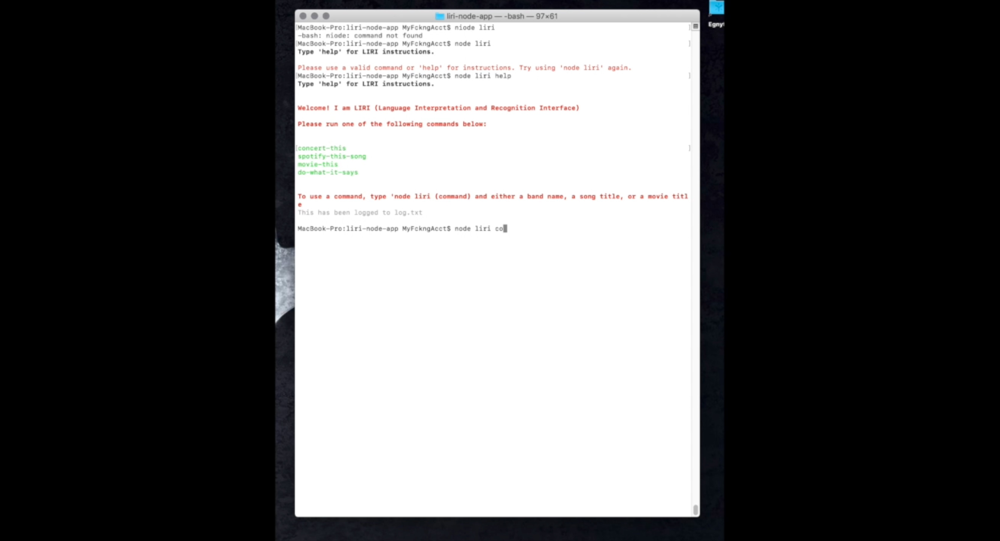
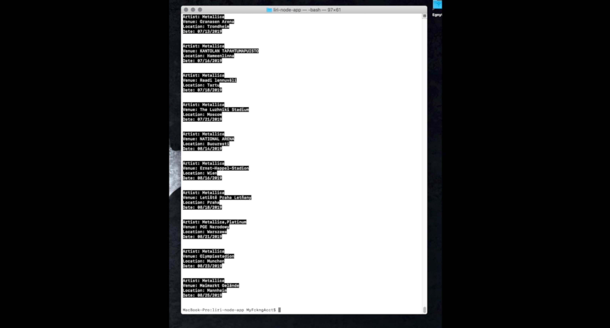
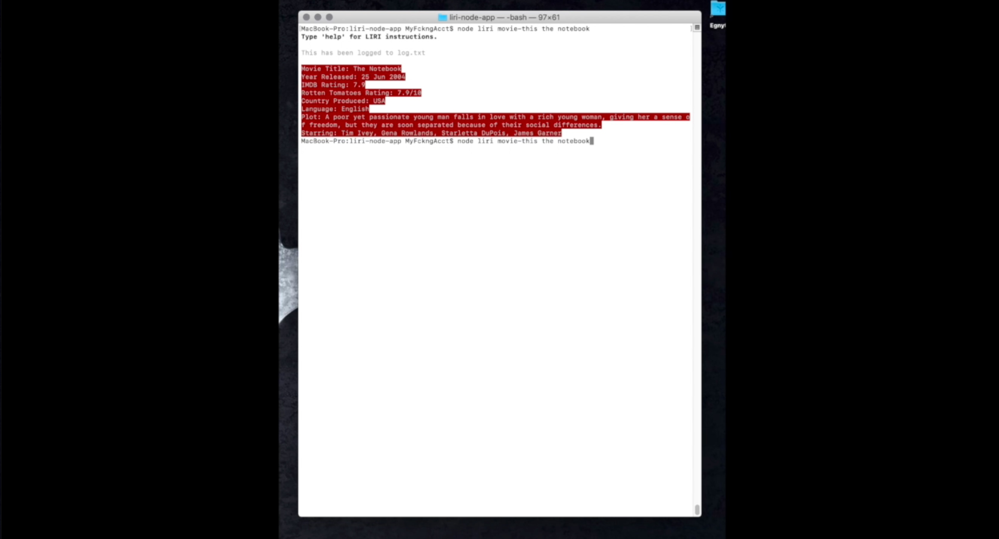
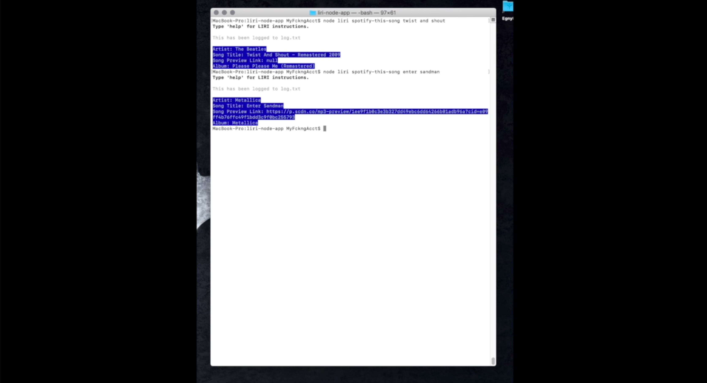
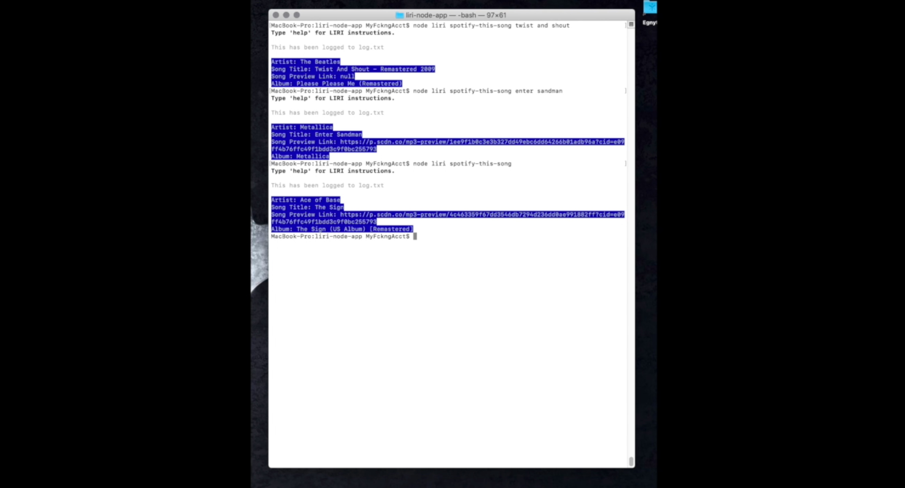
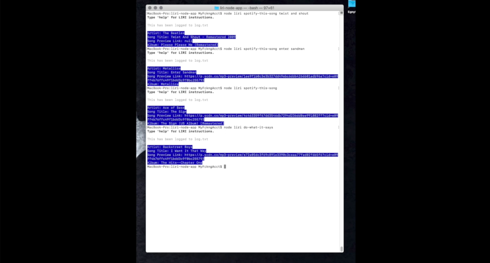

# LIRI (Language Interpretation and Recognition Interface) bot

Much like iPhone's SIRI, LIRI is a doigital assistant. However, while SIRI is a Speech Interpretation and Recognition Interface, LIRI is a _Language_ Interpretation and Recognition Interface. LIRI is a command line node app that takes in parameters and gives back data.

### Getting Started

LIRI bot is a nodeJS program so there are dependencies required. Along with NodeJS (npm install node), you will need to run npm install for the following NPM programs:

* [Node-Spotify-API](https://www.npmjs.com/package/node-spotify-api)
* [Axios](https://www.npmjs.com/package/axios) Axios is used to grab the following 2 APIs
    *  [OMDB API](http://www.omdbapi.com)
    *  [Bands In Town API](http://www.artists.bandsintown.com/bandsintown-api)
* [Moment](https://www.npmjs.com/package/moment)
* [DotEnv](https://www.npmjs.com/package/dotenv)

### Screen Captures

### The Video 

I also made a video and uploaded it to YouTube on it working in real time.
(https://youtu.be/eji96SgaoFo)